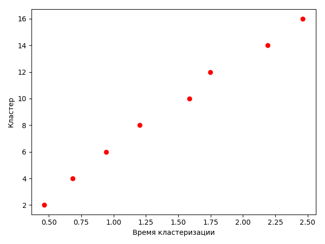
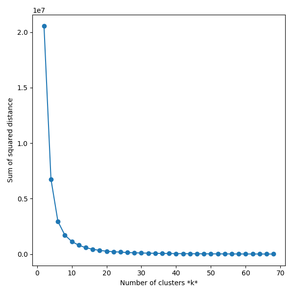
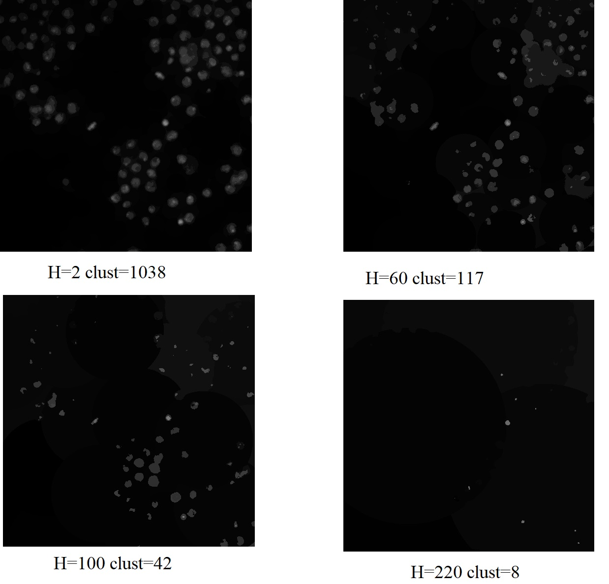
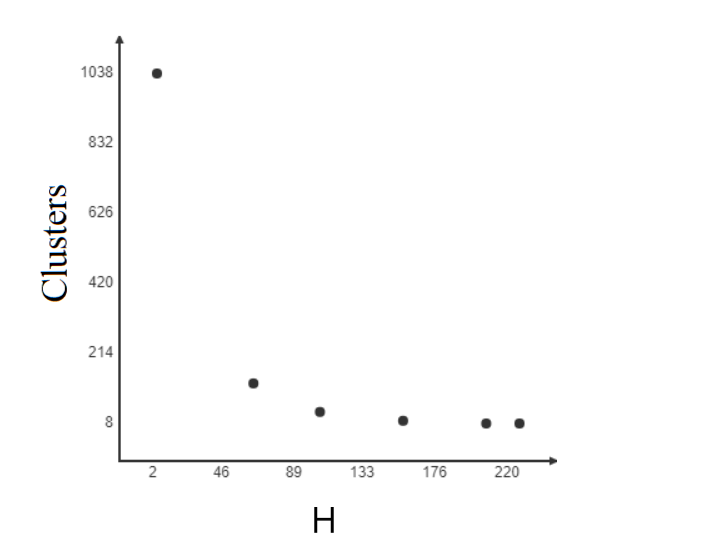

# Сегментация
1. Метод к-средних. 
2. Метод сдвиг среднего.

https://data.broadinstitute.org/bbbc/BBBC002/

## Метод к-средних

Алгоритм разбивает множество элементов векторного пространства на заранее известное число кластеров k.
Основная идея заключается в том, что на каждой итерации перевычисляется центр масс для каждого кластера, полученного на предыдущем шаге, затем векторы разбиваются на кластеры вновь в соответствии с тем, какой из новых центров оказался ближе по выбранной метрике.

Алгоритм завершается, когда на какой-то итерации не происходит изменения внутрикластерного расстояния. Это происходит за конечное число итераций, так как количество возможных разбиений конечного множества конечно, а на каждом шаге суммарное квадратичное отклонение V уменьшается, поэтому зацикливание невозможно.

## Метод сдвига средних

В отличие от  алгоритма K-средних, метод Mean Shift не требует указания количества кластеров заранее. 
Количество кластеров определяется алгоритмом по исходным данным. Направление к ближайшему кластерному центроиду определяется тем, где находится большая часть ближайших точек.
Задается функция оценки плотности, в нашем случае это Гаусово ядро.Затем для множества кластеризуемых точек строится функция градиента ядра оценки плотности и задаётся вектор
среднего сдвига как вектор наибольшего увеличения градиента. Затем выполняются последовательные сдвиги точек на получаемые на каждом этапе векторы среднего сдвига до получения сходимости.
Соответственно, точки, пришедшие в одну и ту же точку сходимости, считают элементами одного и того же кластера.

## Эксперимент
Образец клетки дрозофилы с окрашенным ДНК 

### k-means
K - число кластеров

Кластеризация: 

Время выполнения:

Метод локтя:

Метод дает нам представление о том, какое хорошее число k кластеров будет основано на сумме квадрата расстояния (SSE)
между точками данных и центроидами назначенных им кластеров.

### shift-means
Ввод:
H - Радиус нахождения соседей
Вывод:
Clust - Количество кластеров

# Литература

http://synthesis.ipi.ac.ru/sigmod/seminar/sivogolovko20111124.pdf

https://scikit-learn.org/stable/modules/clustering.html

https://scienceproblems.ru/images/PDF/2017/18/metody-obrabotki.pdf

https://www.sibsutis.ru/upload/iblock/0ee/%D0%94%D0%B8%D1%81%D1%81%D0%B5%D1%80%D1%82%D0%B0%D1%86%D0%B8%D1%8F%20%D0%9A%D1%83%D1%82%D0%BB%D1%83%D0%BD%D0%B8%D0%BD.pdf