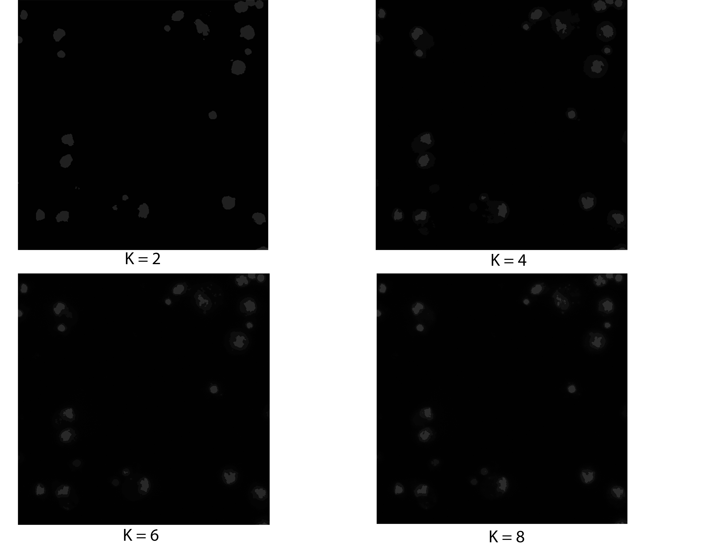

# Сегментация
1. Метод к-средних. 
2. Метод сдвиг среднего.

https://data.broadinstitute.org/bbbc/BBBC002/

## Метод к-средних
### Описание
Алгоритм разбивает множество элементов векторного пространства на заранее известное число кластеров k.
Основная идея заключается в том, что на каждой итерации перевычисляется центр масс для каждого кластера, полученного на предыдущем шаге, затем векторы разбиваются на кластеры вновь в соответствии с тем, какой из новых центров оказался ближе по выбранной метрике.

Алгоритм завершается, когда на какой-то итерации не происходит изменения внутрикластерного расстояния. Это происходит за конечное число итераций, так как количество возможных разбиений конечного множества конечно, а на каждом шаге суммарное квадратичное отклонение V уменьшается, поэтому зацикливание невозможно.

### Эксперимент
Образец клетки дрозофилы с окрашенным ДНК 

K - число кластеров

